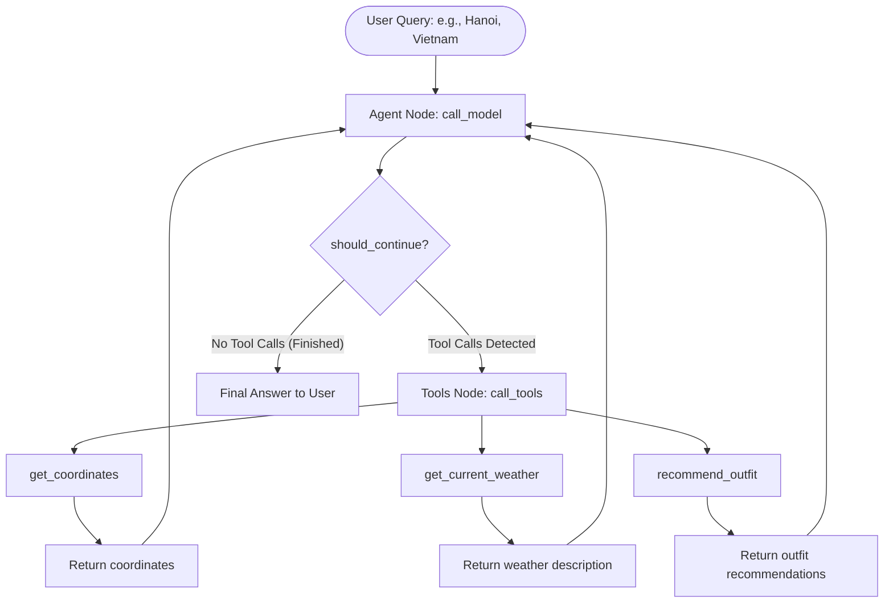

# CONTEXT: PJ02-Weather-ReAct Tool AI Agent

This document defines the learning path, architectural design, and system milestones for building a **ReAct (Reasoning and Action) Tool AI Agent** designed to fetch real-world weather data using OpenWeatherMap and recommend outfits based on a structured JSON database.

---

## 📖 Theoretical Foundation (The ReAct Loop)

As explored in [Reasoning_Agents.ipynb](file:///d:/Personlich/AIO/AIO2025%20-%20Main/_2026_Research/VIN%20Practitioner/Day-3-Lab-Chatbot-vs-react-agent/[Colab]_Reasoning_Agents.ipynb), the **ReAct** pattern integrates reasoning (thinking) and acting (using tools) in a tight feedback loop:

$$\text{Thought} \rightarrow \text{Action} \rightarrow \text{Observation} \rightarrow \text{Thought (Repeat)} \rightarrow \text{Final Answer}$$

### Domain Wisdom Alignment (From DOMAIN-WISDOM.md)
*   **Seed 1: "Each Organ Has One Job"**
    *   *The Brain (LLM)*: Reasons about user intent and plans the step-by-step tool invocation (e.g., first resolve coordinates, then query weather, then recommend outfits).
    *   *The Hands (Tools)*: Executable functions. We have separate specialized tools for geocoding, current weather querying, and JSON-based outfit lookup.
*   **Seed 4: "Projection Is Cheaper Than Computation"**
    *   Rather than forcing the LLM to guess outfit matches or compute them dynamically, we pre-define structured outfit rules in `outfit_recommendations.json` based on OpenWeatherMap's standard weather descriptions.

---

## 🛠️ Architecture & System Design

To query weather using OpenWeatherMap, the agent needs coordinates (`lat`, `lon`). Since users ask questions using `{city}` and `{country}`, our ReAct system uses a two-step retrieval workflow:



### 1. State Definition
Following the `StateGraph` pattern, we track the execution history in a shared `AgentState` dictionary representing messages:
```python
from typing import Annotated, Sequence, TypedDict
from langchain_core.messages import BaseMessage
from langgraph.graph.message import add_messages

class AgentState(TypedDict):
    messages: Annotated[Sequence[BaseMessage], add_messages]
```

### 2. Custom Tools
We define three specialized tools wrapped with LangChain's `@tool` decorator:

| Tool Name | Parameters | Description | Data Source / Returns |
| :--- | :--- | :--- | :--- |
| `get_coordinates` | `city: str`, `country: str` | Resolves a city and country name into geographic coordinates (`lat`, `lon`). | OpenWeatherMap Geocoding API |
| `get_current_weather` | `lat: float`, `lon: float` | Retrieves the current weather description for a specific location using coordinates. | OpenWeatherMap API (Exact implementation below) |
| `recommend_outfit` | `weather_description: str` | Matches a weather description to outfit recommendations. | Looks up `outfit_recommendations.json` |

---

## 📄 Reference Code Format

Our implementation strictly mirrors the **Custom ReAct with `StateGraph`** pattern from the reference notebook:

### 1. Tool Implementations

```python
import requests
from langchain_core.tools import tool

API_KEY = "d8376952ee1e3b3e591cec518a7d41cb"

@tool
def get_coordinates(city: str, country: str) -> dict:
    """
    Resolves a city and country name to latitude and longitude coordinates.

    Args:
        city: The name of the city.
        country: The name of the country.

    Returns:
        dict: A dictionary containing 'lat' and 'lon', or None if not found.
    """
    api_url = f"https://api.openweathermap.org/geo/1.0/direct?q={city},{country}&limit=1&appid={API_KEY}"
    try:
        response = requests.get(api_url)
        response.raise_for_status()
        data = response.json()
        if data:
            return {"lat": data[0]["lat"], "lon": data[0]["lon"]}
        return None
    except (requests.RequestException, ValueError, KeyError, IndexError) as e:
        print(f"Error retrieving coordinates: {e}")
        return None

@tool
def get_current_weather(lat: float, lon: float) -> str:
    """
    Retrieves the current weather description for a specific geographical location.

    Args:
        lat: The latitude of the location.
        lon: The longitude of the location.

    Returns:
        str: The current weather description for the location, or None if the weather information could not
            be retrieved.
    """
    api_url = f"https://api.openweathermap.org/data/2.5/weather?lat={lat}&lon={lon}&appid={API_KEY}"
    try:
        response = requests.get(api_url)
        response.raise_for_status()
        data = response.json()
        return data["weather"][0]["description"]
    except (requests.RequestException, ValueError, KeyError) as e:
        print(f"Error retrieving weather information: {e}")
        return None

@tool
def recommend_outfit(weather_description: str) -> dict:
    """
    Recommends clothing outfits based on the current weather description.

    Args:
        weather_description: The descriptive weather string (e.g., 'clear sky', 'moderate rain').

    Returns:
        dict: Recommended outfits and clothing tips.
    """
    import json
    # Local lookup from structured database
    try:
        with open("outfit_recommendations.json", "r", encoding="utf-8") as f:
            outfits = json.load(f)
        
        # Simple lookup: convert weather_description to lower case
        desc = weather_description.lower()
        
        # Find best match from database
        for key, value in outfits.items():
            if key in desc or desc in key:
                return value
                
        # Default fallback if no match is found
        return outfits.get("default", {"outfit": "Casual wear: T-shirt, jeans, and a light jacket.", "tips": "Check weather changes."})
    except Exception as e:
        print(f"Error reading outfit recommendation database: {e}")
        return {"outfit": "Standard casual clothes.", "tips": "Unable to load database."}
```

### 2. Custom LangGraph Loop
```python
import json
from langchain_core.messages import SystemMessage, ToolMessage
from langgraph.graph import StateGraph, END

# Define Nodes
def call_model(state: AgentState):
    """Invokes the LLM with the current message history and bound tools."""
    # Bound with: model.bind_tools(TOOLS)
    return {"messages": [model_with_tools.invoke([SYSTEM_PROMPT] + list(state["messages"]))] }

def call_tools(state: AgentState):
    """Executes the specific tool calls requested by the LLM."""
    last_message = state["messages"][-1]
    tool_messages = []
    for tool_call in last_message.tool_calls:
        tool_name = tool_call["name"]
        tool_args = tool_call["args"]
        # Invoke the correct tool
        observation = TOOLS_BY_NAME[tool_name].invoke(tool_args)
        tool_messages.append(
            ToolMessage(
                content=json.dumps(observation, ensure_ascii=False, default=str),
                name=tool_name,
                tool_call_id=tool_call["id"]
            )
        )
    return {"messages": tool_messages}

def should_continue(state: AgentState):
    """Reroutes control flow to 'tools' if tool calls are present, else terminates."""
    last_message = state["messages"][-1]
    if last_message.tool_calls:
        return "tools"
    return END

# Graph Construction
workflow = StateGraph(AgentState)
workflow.add_node("agent", call_model)
workflow.add_node("tools", call_tools)
workflow.set_entry_point("agent")
workflow.add_conditional_edges("agent", should_continue, {"tools": "tools", END: END})
workflow.add_edge("tools", "agent")
react_graph = workflow.compile()
```

---

## 🎯 System Design Milestones & Definition of Done

We establish **4 milestones** as our absolute Definition of Done (DoD) for this project:

### Milestone 1: Data Modeling & Schema Design
*   [ ] Create a structured `outfit_recommendations.json` database containing mapping entries for standard weather states (e.g., `clear sky`, `clouds`, `rain`, `drizzle`, `thunderstorm`, `snow`, `mist`, `default`).
*   [ ] Add descriptive fields inside the outfit mapping database: `{ "outfit": "Suggested clothing items...", "tips": "Additional advice (e.g. bring an umbrella)" }`.

### Milestone 2: Functional Tool Implementation
*   [ ] Implement `@tool` `get_coordinates` querying OpenWeatherMap Geocoding API.
*   [ ] Implement `@tool` `get_current_weather` with the exact provided coordinates signature.
*   [ ] Implement `@tool` `recommend_outfit` reading mapping parameters locally from `outfit_recommendations.json`.
*   [ ] Write a verification script executing all tools in isolation to verify correct JSON schema outputs and active API connections.

### Milestone 3: ReAct StateGraph Integration
*   [ ] Initialize the ReAct workflow engine using `StateGraph` and configure routing with `should_continue`.
*   [ ] Bind the weather geocoding, retrieval, and outfit recommendation tools to the LLM.
*   [ ] Standardize the system prompt to guide the agent to perform geocoding before fetching weather details.

### Milestone 4: Verification, Evaluation & Quality Assurance
*   [ ] Execute validation cases matching queries like: *"Recommend an outfit for Hanoi, Vietnam today."*
*   [ ] Inspect logs to ensure the agent resolves `get_coordinates` first, passes coordinate values directly into `get_current_weather`, uses the return description in `recommend_outfit`, and successfully outputs final instructions.
*   [ ] Build robust exception blocks protecting against missing inputs, invalid network queries, or API timeouts.
